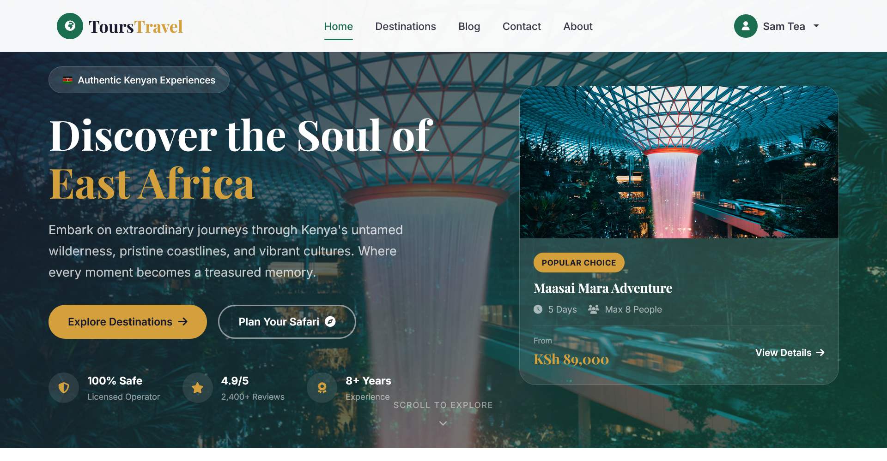
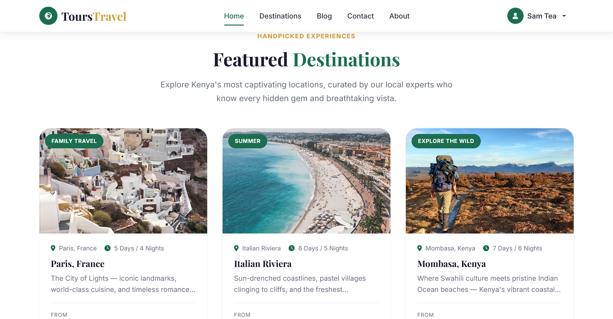
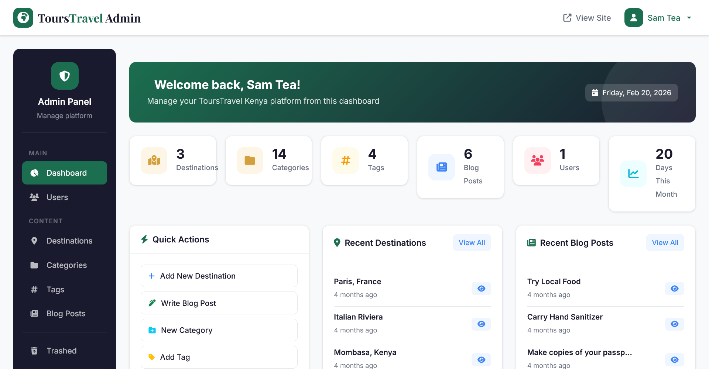
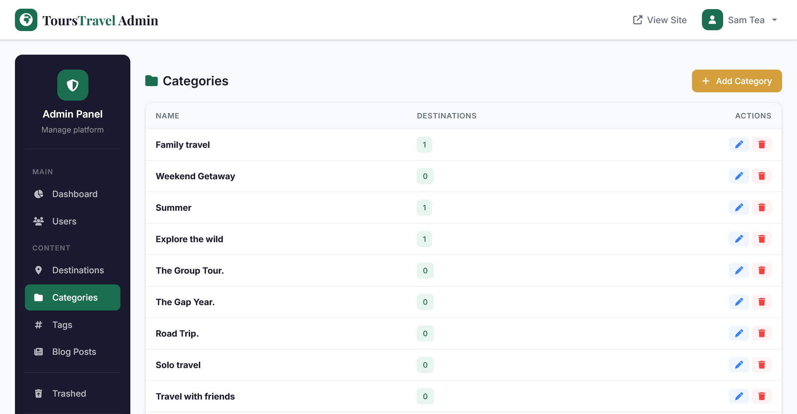

# ToursTravel Kenya

[](https://github.com/muchaisam/Tours-Travel/actions/workflows/tests.yml)
[](https://php.net)
[](https://laravel.com)
[](LICENSE)

A full-stack travel booking platform built with **Laravel 11**, **Bootstrap 5**, **Stripe**, and a **RESTful API**. The codebase demonstrates MVC architecture with service layer, policy-based authorization, soft deletes, Eloquent scopes, form request validation, API resources, and a CI pipeline with automated testing (68 tests), code style enforcement, and security auditing.

## Tech Stack

| Layer | Technology |
|-------|------------|
| Framework | Laravel 11 (PHP 8.2+) |
| Frontend | Blade templates, Bootstrap 5.3, CSS custom properties design system |
| Database | MySQL 8, 17 migrations, Eloquent ORM with soft deletes |
| Payments | Stripe PHP SDK |
| Auth | Laravel UI, email verification, role-based admin middleware |
| API | Versioned REST (`/api/v1`), JSON Resources + Collections |
| Testing | PHPUnit 11 — 68 tests, 149 assertions, SQLite in-memory |
| CI/CD | GitHub Actions (test + lint + security audit → Railway deploy) |
| Containerization | Docker + docker-compose |

## Screenshots

<p float="left">
  
  
</p>
<p float="left">
  
  
</p>
<p align="center">
  
</p>

## Architecture

```
HTTP Request
    │
    ├── web.php ─── Middleware (auth, admin, isVerified)
    │                    │
    │                    ▼
    │              Form Requests (9 classes — validation)
    │                    │
    │                    ▼
    │              Controllers ──── Policies (admin-gated writes, public reads)
    │                    │
    │                    ▼
    │              Services (ImageService, SearchService)
    │                    │
    │                    ▼
    │              Eloquent Models (soft deletes, scopes, accessors)
    │                    │
    │                    ▼
    │              MySQL (17 migrations)
    │
    └── api.php ─── API Controllers → JSON Resources/Collections
```

### Key Patterns

**Service layer** — Business logic extracted from controllers:
- `ImageService` — upload/delete/replace via Storage facade
- `SearchService` — keyword search, category/tag filtering, sorting, pagination via composable query builder

**Policy-based authorization** — `DestinationPolicy` and `BlogPolicy` gate write operations to admins while allowing public reads (nullable `$user` on `view`/`viewAny`).

**Form Request validation** — 9 dedicated request classes under `app/Http/Requests/{Blog,Categories,Destinations,Tags,Users}/` keep validation logic out of controllers.

**Eloquent scopes & accessors** — `Destinations` model uses `published()`, `recent($limit)`, `inCategory($id)`, `withTags($ids)` scopes and computed `average_rating`/`reviews_count` accessors.

**Soft deletes** — `Destinations` and `Blog` models use `SoftDeletes` trait with dedicated restore routes and a trashed items view.

**API Resources** — `DestinationResource`, `DestinationCollection`, `CategoryResource`, `ReviewResource`, `TagResource`, `BookingResource` transform Eloquent models into versioned JSON responses with pagination metadata.

**Admin Dashboard** — A role-gated admin panel (`VerifyIsAdmin` middleware) for managing platform content. Includes a stats overview dashboard (destination/blog/user/category/tag counts, recent activity timeline), full CRUD interfaces for destinations, blog posts, categories, and tags, user management with admin role promotion, soft-deleted content recovery, and image upload handling. The dashboard uses its own layout (`layouts/app.blade.php`) with a sidebar navigation, topbar, and a dedicated CSS design system (`admin.css`) that shares the same color palette as the public site.

### Data Model

```
Users ──┬── Reviews ──── Destinations ──┬── Tags (M2M pivot)
        ├── Bookings ─── Destinations   ├── Category (belongsTo)
        ├── Wishlists ── Destinations   └── Reviews (hasMany)
        └── Cart
Blog ─────── Category (belongsTo)
```

### Route Groups & Middleware

| Group | Middleware | Routes |
|-------|-----------|--------|
| Public | — | Home, packages, blog, about, contact, cart, checkout |
| Auth | `auth` | CRUD resources (destinations, blog, categories, tags), reviews, wishlist |
| Admin | `auth`, `admin` | User management, make-admin |
| Verified | `isVerified` | Email verification callbacks |
| API v1 | — | `GET /api/v1/destinations`, search, featured, categories |
| API v1 Auth | `auth:api` | User profile, bookings, wishlist |

## Testing

68 tests across 13 test classes, all running against SQLite `:memory:` (no MySQL needed):

```bash
./vendor/bin/phpunit              # All tests
./vendor/bin/phpunit --testdox    # Verbose output
```

### Test Coverage

| Suite | Class | Tests | What's Covered |
|-------|-------|-------|----------------|
| Feature | `PublicPagesTest` | 6 | All public routes return 200 |
| Feature | `DestinationTest` | 10 | CRUD, soft delete, restore, authorization, validation |
| Feature | `BlogTest` | 7 | CRUD, authorization, validation |
| Feature | `CartTest` | 3 | Cart page, HTTP method enforcement |
| Feature | `LoginTest` | 4 | Render, auth, invalid password, logout |
| Feature | `RegistrationTest` | 4 | Render, register, email validation, password confirmation |
| Feature | `AdminAccessTest` | 5 | Admin middleware, role escalation |
| Feature | `DestinationApiTest` | 8 | List, filter, show, featured, search, relationships |
| Unit | `UserTest` | 5 | `isAdmin()`, `makeAdmin()`, fillable, hidden attributes |
| Unit | `DestinationTest` | 8 | Relationships, soft deletes, scopes (published, recent, inCategory) |
| Unit | `ImageServiceTest` | 7 | Upload, delete, replace, getUrl, edge cases |
| Unit/Feature | `ExampleTest` | 2 | Smoke tests |

### CI Pipeline (`.github/workflows/tests.yml`)

Runs on push to `main`/`dev` and all PRs:

1. **Tests** — PHP 8.2, MySQL 8 service, `composer install`, `npm run dev`, `phpunit --coverage-text`
2. **Code style** — `./vendor/bin/pint --test` (Laravel Pint)
3. **Security** — `composer audit` (vulnerability scanning)

Deploys to Railway on main branch merge (`.github/workflows/deploy.yml`).

## API

All endpoints prefixed with `/api/v1`, returning JSON with proper pagination and relationship includes.

| Method | Endpoint | Description |
|--------|----------|-------------|
| `GET` | `/destinations` | Paginated list (supports `?category=` filter) |
| `GET` | `/destinations/{id}` | Single destination with category, tags, reviews |
| `GET` | `/destinations/featured` | Featured destinations |
| `GET` | `/destinations/search?q=` | Keyword search across title/description/content |
| `GET` | `/categories` | All categories with destination counts |
| `GET` | `/categories/{id}` | Single category |

Response format uses Laravel API Resources with `data`, `meta` (pagination), and `links` wrappers.

Full docs → [docs/API.md](docs/API.md)

## Setup

### Prerequisites

- PHP 8.2+
- Composer
- Node.js & npm
- MySQL 8

### Installation

```bash
git clone https://github.com/muchaisam/Tours-Travel.git
cd Tours-Travel

composer install && npm install
cp .env.example .env
php artisan key:generate
```

### Database Configuration

Update your `.env` file with your MySQL credentials:

```env
DB_CONNECTION=mysql
DB_HOST=127.0.0.1
DB_PORT=3306
DB_DATABASE=tours_travel
DB_USERNAME=root
DB_PASSWORD=your_password
```

### Migrate & Seed

```bash
php artisan migrate --seed
php artisan storage:link
```

This runs all **18 migrations** and seeds the database with:

| Seeder | What it creates |
|--------|-----------------|
| `UsersTableSeeder` | Admin account (see credentials below) |
| `DestinationsTableSeeder` | 3 destinations (Paris, Italian Riviera, Mombasa) + 9 categories + 4 tags |
| `BlogsTableSeeder` | Sample blog posts |

### Run the App

```bash
php artisan serve   # localhost:8000
npm run dev         # Build frontend assets
```

### Docker (Alternative)

```bash
docker-compose up -d
docker-compose exec app php artisan migrate --seed
# localhost:8080
```

### Demo Account

Once seeded, you can log in with the pre-configured admin account:

| Field | Value |
|-------|-------|
| Email | `samadmin@gmail.com` |
| Password | `password` |
| Role | Admin |

This account has full access to the admin dashboard at `/home`, including destination/blog CRUD, user management, and content moderation.

## Project Structure

```
app/
├── Http/
│   ├── Controllers/
│   │   ├── Api/                       # DestinationApiController, CategoryApiController
│   │   ├── DestinationsController.php # CRUD + soft delete/restore
│   │   ├── BlogController.php         # CRUD + soft delete/restore
│   │   ├── CheckoutController.php     # Stripe integration
│   │   ├── ReviewController.php       # Star ratings
│   │   └── WishlistController.php     # Toggle/store/destroy
│   ├── Middleware/
│   │   └── VerifyIsAdmin.php          # Admin role gate
│   ├── Requests/                      # 9 form request classes
│   └── Resources/                     # 6 API resource classes
├── Policies/                          # DestinationPolicy, BlogPolicy, etc.
├── Services/
│   ├── ImageService.php               # Upload/delete/replace via Storage
│   └── SearchService.php              # Filtering, search, scopes
├── Mail/                              # Mailable classes
├── Destinations.php                   # SoftDeletes, scopes, computed attributes
├── Blog.php                           # SoftDeletes
├── User.php                           # isAdmin(), makeAdmin()
└── ...
tests/
├── Feature/
│   ├── Auth/                          # LoginTest, RegistrationTest, AdminAccessTest
│   ├── Api/                           # DestinationApiTest
│   ├── DestinationTest.php            # 10 tests (CRUD + authorization)
│   ├── BlogTest.php                   # 7 tests
│   ├── CartTest.php
│   └── PublicPagesTest.php
└── Unit/
    ├── Models/                        # UserTest, DestinationTest
    └── Services/                      # ImageServiceTest
```

## License

[MIT](LICENSE)
